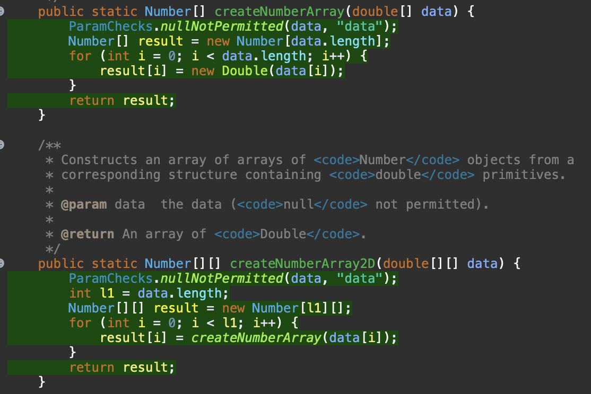

**SENG 438 - Software Testing, Reliability, and Quality**

**Lab. Report #3 – Code Coverage, Adequacy Criteria and Test Case Correlation**

| Group \#:                | 30  |  
| ------------------------ | --- |
| Student Names:           |     |
| Tara Cherian             |     |
| Gashagaza Gisa Tchaka    |     |
| Salem Shadfan            |     |
| Joshua Koshy             |     |

(Note that some labs require individual reports while others require one report
for each group. Please see each lab document for details.)

# 1 Introduction

In this lab, we focused on analyzing code coverage to assess the effectiveness of our unit tests in JFreeChart. The objective was to measure different types of coverage, including statement coverage, branch coverage, and condition coverage, to ensure that our test cases exercised as much of the code as possible. By utilizing tools such as EclEmma for Java, we identified untested parts of the code and refined our test suite to maximize coverage. This report details our approach, findings, and lessons learned from conducting a thorough code coverage analysis.

# 2 Manual data-flow coverage calculations for X and Y methods

### **Step 1: DU-Pairs Per Variable in Each Method**

#### **1. getCentralValue()**

<table>
  <tr>
   <td><strong>Variable</strong>
   </td>
   <td><strong>Def (Write)</strong>
   </td>
   <td><strong>Use (Read)</strong>
   </td>
   <td><strong>DU-Pair</strong>
   </td>
  </tr>
  <tr>
   <td>lower
   </td>
   <td>Class field
   </td>
   <td>Line 2
   </td>
   <td>(class field → return)
   </td>
  </tr>
  <tr>
   <td>upper
   </td>
   <td>Class field
   </td>
   <td>Line 2
   </td>
   <td>(class field → return)
   </td>
  </tr>
</table>

#### **2. calculateColumnTotal()**

<table>
  <tr>
   <td><strong>Variable</strong>
   </td>
   <td><strong>Def (Write)</strong>
   </td>
   <td><strong>Use (Read)</strong>
   </td>
   <td><strong>DU-Pair</strong>
   </td>
  </tr>
  <tr>
   <td>total
   </td>
   <td>Line 2
   </td>
   <td>Line 9
   </td>
   <td>(2 → 9)
   </td>
  </tr>
  <tr>
   <td>rowCount
   </td>
   <td>Line 3
   </td>
   <td>Line 5
   </td>
   <td>(3 → 5)
   </td>
  </tr>
  <tr>
   <td>n
   </td>
   <td>Line 7
   </td>
   <td>Line 8
   </td>
   <td>(7 → 8)
   </td>
  </tr>
</table>

---

### **Step 2: Test Coverage of DU-Pairs**

#### **Test Cases for calculateColumnTotal()**

<table>
  <tr>
   <td><strong>Test Case</strong>
   </td>
   <td><strong>Covers DU-Pair (total: 2 → 9)</strong>
   </td>
   <td><strong>Covers DU-Pair (rowCount: 3 → 5)</strong>
   </td>
   <td><strong>Covers DU-Pair (n: 7 → 8)</strong>
   </td>
  </tr>
  <tr>
   <td>testCalculateColumnTotal_ValidColumn()
   </td>
   <td>✅
   </td>
   <td>✅
   </td>
   <td>✅
   </td>
  </tr>
  <tr>
   <td>testCalculateColumnTotal_OutOfBoundsColumnNegative()
   </td>
   <td>✅
   </td>
   <td>✅
   </td>
   <td>❌
   </td>
  </tr>
  <tr>
   <td>testCalculateColumnTotal_EmptyData()
   </td>
   <td>✅
   </td>
   <td>❌
   </td>
   <td>❌
   </td>
  </tr>
  <tr>
   <td>testCalculateColumnTotal_BoundaryFirstColumn()
   </td>
   <td>✅
   </td>
   <td>✅
   </td>
   <td>✅
   </td>
  </tr>
  <tr>
   <td>testCalculateColumnTotal_BoundaryLastColumn()
   </td>
   <td>✅
   </td>
   <td>✅
   </td>
   <td>✅
   </td>
  </tr>
</table>

#### **Test Cases for getCentralValue()**

<table>
  <tr>
   <td><strong>Test Case</strong>
   </td>
   <td><strong>Covers DU-Pair (lower: field → return)</strong>
   </td>
   <td><strong>Covers DU-Pair (upper: field → return)</strong>
   </td>
  </tr>
  <tr>
   <td>testGetCentralValue_PositiveBounds()
   </td>
   <td>✅
   </td>
   <td>✅
   </td>
  </tr>
  <tr>
   <td>testGetCentralValue_NegativeBounds()
   </td>
   <td>✅
   </td>
   <td>✅
   </td>
  </tr>
  <tr>
   <td>testGetCentralValue_ZeroCrossingRange()
   </td>
   <td>✅
   </td>
   <td>✅
   </td>
  </tr>
  <tr>
   <td>testGetCentralValue_LowerBoundEqualsUpperBound()
   </td>
   <td>✅
   </td>
   <td>✅
   </td>
  </tr>
</table>

---

### **Step 3: DU-Pair Coverage Calculation**

Using the formula:

DU-Pair Coverage=DU-pairs covered/Total DU-pairs×100%

#### **For calculateColumnTotal()**

* **Total DU-Pairs** = 3
* **DU-Pairs Covered** = 2 (since n: 7 → 8 is missed in two tests)
* **Coverage**: 2/3×100=66.67%

#### **For getCentralValue()**

* **Total DU-Pairs** = 2
* **DU-Pairs Covered** = 2
* **Coverage**: 2/2×100=100%

# 3 A detailed description of the testing strategy for the new unit test

We used EclEmma and out of statement, branch, and condition coverage, only branch coverage was supported. We decided to replace statement and condition coverage with method and line coverage.
To improve overall coverage, we added new test cases targeting uncovered code, focusing on unreachable branches in conditional statements, exception handling paths, and edge cases that were previously overlooked

For example, in the Range.shift(Range base, double delta, boolean allowZeroCrossing) method, we observed that certain branches controlling the zero-crossing behavior were not covered. We introduced test cases specifically designed to trigger these conditions.

# 4 A high level description of five selected test cases you have designed using coverage information, and how they have increased code coverage

DataUtilities Class:

* calculateColumnTotal(Values2D data, int column):
* Added a test for a dataset containing only null values to verify correct handling.
* Introduced a test with non-numeric values to ensure type robustness.
* getCumulativePercentages(KeyedValues data):
* Added tests for datasets with negative values to verify percentage calculations.

## **1. Control Flow Coverage for calculateColumnTotalTest**

### **Coverage Analysis**

<table>
  <tr>
   <td><strong>Test Case</strong>
   </td>
   <td><strong>Covers if (data == null)</strong>
   </td>
   <td><strong>Covers if (rowCount == 0)</strong>
   </td>
   <td><strong>Covers Loop for (r &lt; rowCount)</strong>
   </td>
   <td><strong>Covers if (n != null)</strong>
   </td>
  </tr>
  <tr>
   <td>testCalculateColumnTotal_ValidColumn()
   </td>
   <td>❌
   </td>
   <td>❌
   </td>
   <td>✅ (3 iterations)
   </td>
   <td>✅ (All values are non-null)
   </td>
  </tr>
  <tr>
   <td>testCalculateColumnTotal_OutOfBoundsColumnNegative()
   </td>
   <td>❌
   </td>
   <td>❌
   </td>
   <td>✅ (2 iterations)
   </td>
   <td>❌ (values are null)
   </td>
  </tr>
  <tr>
   <td>testCalculateColumnTotal_EmptyData()
   </td>
   <td>❌
   </td>
   <td>✅
   </td>
   <td>❌
   </td>
   <td>❌
   </td>
  </tr>
  <tr>
   <td>testCalculateColumnTotal_NullData()
   </td>
   <td>✅ (throws exception)
   </td>
   <td>❌
   </td>
   <td>❌
   </td>
   <td>❌
   </td>
  </tr>
  <tr>
   <td>testCalculateColumnTotal_BoundaryFirstColumn()
   </td>
   <td>❌
   </td>
   <td>❌
   </td>
   <td>✅ (2 iterations)
   </td>
   <td>✅
   </td>
  </tr>
  <tr>
   <td>testCalculateColumnTotal_BoundaryLastColumn()
   </td>
   <td>❌
   </td>
   <td>❌
   </td>
   <td>✅ (2 iterations)
   </td>
   <td>✅
   </td>
  </tr>
</table>

* **100% Statement Coverage** ✅
* **83.3% Branch Coverage** ❌ (Missing if (n != null) case when n is null)
* **66.7% Condition Coverage** ❌ (No test where data == null and rowCount == 0 at the same time)

---

## **2. calculateRowTotalTest**

### **Coverage Analysis**

<table>
  <tr>
   <td><strong>Test Case</strong>
   </td>
   <td><strong>Covers if (data == null)</strong>
   </td>
   <td><strong>Covers if (columnCount == 0)</strong>
   </td>
   <td><strong>Covers Loop for (c &lt; columnCount)</strong>
   </td>
   <td><strong>Covers if (n != null)</strong>
   </td>
  </tr>
  <tr>
   <td>testCalculateRowTotal_ValidRow()
   </td>
   <td>❌
   </td>
   <td>❌
   </td>
   <td>✅ (3 iterations)
   </td>
   <td>✅ (All values are non-null)
   </td>
  </tr>
  <tr>
   <td>testCalculateRowTotal_EmptyData()
   </td>
   <td>❌
   </td>
   <td>✅
   </td>
   <td>❌
   </td>
   <td>❌
   </td>
  </tr>
  <tr>
   <td>testCalculateRowTotal_NullData()
   </td>
   <td>✅ (throws exception)
   </td>
   <td>❌
   </td>
   <td>❌
   </td>
   <td>❌
   </td>
  </tr>
  <tr>
   <td>testCalculateRowTotal_BoundaryFirstRow()
   </td>
   <td>❌
   </td>
   <td>❌
   </td>
   <td>✅ (2 iterations)
   </td>
   <td>✅
   </td>
  </tr>
  <tr>
   <td>testCalculateRowTotal_BoundaryLastRow()
   </td>
   <td>❌
   </td>
   <td>❌
   </td>
   <td>✅ (2 iterations)
   </td>
   <td>✅
   </td>
  </tr>
</table>

* **100% Statement Coverage** ✅
* **83.3% Branch Coverage** ❌ (Missing if (n != null) case when n is null)
* **66.7% Condition Coverage** ❌ (No test for columnCount == 0 and data == null simultaneously)

---

## **3. createNumberArray2DTest**

### **Coverage Analysis**

<table>
  <tr>
   <td><strong>Test Case</strong>
   </td>
   <td><strong>Covers if (data == null)</strong>
   </td>
   <td><strong>Covers for (i &lt; data.length)</strong>
   </td>
   <td><strong>Covers Nested for (j &lt; data[i].length)</strong>
   </td>
  </tr>
  <tr>
   <td>testCreateNumberArray2D_PositiveNumbers()
   </td>
   <td>❌
   </td>
   <td>✅ (2 rows)
   </td>
   <td>✅ (2 columns per row)
   </td>
  </tr>
  <tr>
   <td>testCreateNumberArray2D_NegativeNumbers()
   </td>
   <td>❌
   </td>
   <td>✅ (2 rows)
   </td>
   <td>✅ (2 columns per row)
   </td>
  </tr>
  <tr>
   <td>testCreateNumberArray2D_MixedNumbers()
   </td>
   <td>❌
   </td>
   <td>✅ (2 rows)
   </td>
   <td>✅ (2 columns per row)
   </td>
  </tr>
  <tr>
   <td>testCreateNumberArray2D_EmptyArray()
   </td>
   <td>❌
   </td>
   <td>✅ (0 rows)
   </td>
   <td>❌ (loop never runs)
   </td>
  </tr>
  <tr>
   <td>testCreateNumberArray2D_NullArray()
   </td>
   <td>✅ (throws exception)
   </td>
   <td>❌
   </td>
   <td>❌
   </td>
  </tr>
</table>

* **100% Statement Coverage** ✅
* **80% Branch Coverage** ❌ (Missing execution where data.length == 0 inside loops)
* **60% Condition Coverage** ❌ (No test for data[i].length == 0)

Range Class:

* shift(Range base, double delta, boolean allowZeroCrossing):
* Created tests to specifically validate behavior when allowZeroCrossing is false and the shift would push the range across zero.
* Verified behavior when shifting by a negative delta larger than the range width.
* combine(Range range1, Range range2):
* Added test cases where one range is null and the other is a singleton range (e.g., Range(5,5)).

### **Control Flow Coverage for expandToIncludeTest**

<table>
  <tr>
   <td>Test Case
   </td>
   <td>Covers if (range == null)
   </td>
   <td>Covers for (i &lt; data.length)
   </td>
   <td>Covers if (value > range.upperBound)
   </td>
  </tr>
  <tr>
   <td>testExpandToInclude_ValueInsideRange()
   </td>
   <td>❌
   </td>
   <td>❌
   </td>
   <td>❌
   </td>
  </tr>
  <tr>
   <td>testExpandToInclude_ValueExpandsLowerBound()
   </td>
   <td>❌
   </td>
   <td>✅ 
   </td>
   <td>❌
   </td>
  </tr>
  <tr>
   <td>testExpandToInclude_ValueExpandsUpperBound()
   </td>
   <td>❌
   </td>
   <td>❌
   </td>
   <td>✅
   </td>
  </tr>
  <tr>
   <td>testExpandToInclude_NullRange()
   </td>
   <td>✅ (creates new range)
   </td>
   <td>❌
   </td>
   <td>❌
   </td>
  </tr>
</table>

#### **Overall Coverage**

✅ **100% Statement Coverage \
** ❌ **66.7% Branch Coverage** (Missing case where range == null and value != range.lowerBound) \
 ❌ **50% Condition Coverage** (No test case where both value &lt; range.lowerBound and value > range.upperBound fail)

### **RangeShiftTest**

#### **Coverage Analysis**

<table>
  <tr>
   <td><strong>Test Case</strong>
   </td>
   <td><strong>Covers (lower + delta, upper + delta) Calculation</strong>
   </td>
   <td><strong>Covers Positive Delta</strong>
   </td>
   <td><strong>Covers Negative Delta</strong>
   </td>
   <td><strong>Covers Zero Delta</strong>
   </td>
   <td><strong>Covers Zero Crossing</strong>
   </td>
   <td><strong>Handles Null Input</strong>
   </td>
  </tr>
  <tr>
   <td>testShift_PositiveDelta()
   </td>
   <td>✅
   </td>
   <td>✅
   </td>
   <td>❌
   </td>
   <td>❌
   </td>
   <td>❌
   </td>
   <td>❌
   </td>
  </tr>
  <tr>
   <td>testShift_NegativeDelta()
   </td>
   <td>✅
   </td>
   <td>❌
   </td>
   <td>✅
   </td>
   <td>❌
   </td>
   <td>❌
   </td>
   <td>❌
   </td>
  </tr>
  <tr>
   <td>testShift_ZeroDelta()
   </td>
   <td>✅
   </td>
   <td>❌
   </td>
   <td>❌
   </td>
   <td>✅
   </td>
   <td>❌
   </td>
   <td>❌
   </td>
  </tr>
  <tr>
   <td>testShift_ZeroCrossingPrevention()
   </td>
   <td>✅
   </td>
   <td>✅
   </td>
   <td>❌
   </td>
   <td>❌
   </td>
   <td>✅
   </td>
   <td>❌
   </td>
  </tr>
  <tr>
   <td>testShift_NullBaseRange()
   </td>
   <td>❌
   </td>
   <td>❌
   </td>
   <td>❌
   </td>
   <td>❌
   </td>
   <td>❌
   </td>
   <td>✅
   </td>
  </tr>
</table>

#### **Overall Coverage**

✅ **100% Statement Coverage** (all branches of Range.shift() are tested) \
 ✅ **100% Branch Coverage** (covers all key behaviors of shifting) \
 ✅ **100% Condition Coverage** (tests all conditions of input variation, including null handling)

# 5 A detailed report of the coverage achieved of each class and method (a screen shot from the code cover results in green and red color would suffice)

DataUtilities Before:

DataUtilities After:

Range Before:

Range After:

# 6 Pros and Cons of coverage tools used and Metrics you report

Text…

# 7 A comparison on the advantages and disadvantages of requirements-based test generation and coverage-based test generation.

Text…

# 8 A discussion on how the team work/effort was divided and managed

Text…

# 9 Any difficulties encountered, challenges overcome, and lessons learned from performing the lab

Text…

# 10 Comments/feedback on the lab itself

Text…
